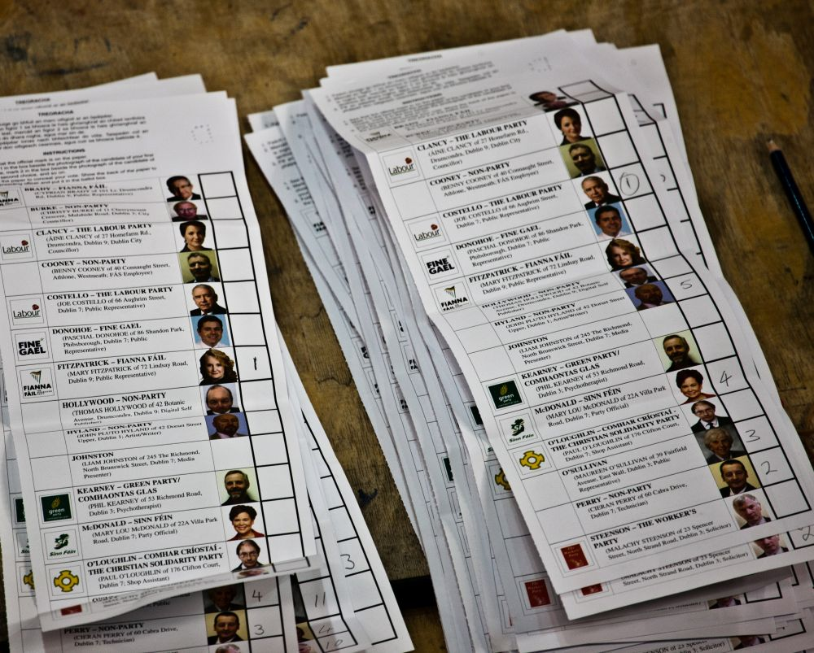

# Overview

## Overview

TODO

## Acknowledgements :moneybag:

Australian Research Council (ARC):

- Discovery Project [DP220101012](https://dataportal.arc.gov.au/NCGP/Web/Grant/Grant/DP220101012)
- OPTIMA ITTC [IC200100009](https://dataportal.arc.gov.au/NCGP/Web/Grant/Grant/IC200100009)

European Research Council (ERC):

- CertiFOX, [101122653](https://doi.org/10.3030/101122653)

# STV & margins

## Single Transferable Vote (STV)

- Multi-winner system with ranked ballots
- Aims for proportional representation
- A.k.a. "proportional ranked-choice voting"

. . .

::: callout-tip
### Used for national and other government elections

- Australia, Ireland, Malta
:::

. . .

::: callout-tip
### Used for local government elections

- Aotearoa/New Zealand, Northern Ireland, Scotland, USA
:::

## STV voting

::::: columns
:::: {.column width="60%"}

::::

:::: {.column width="40%"}
Voters rank candidates in preference order

. . .

::: callout-tip
### Examples

- \(1\) Melanie, (2) Peter, (3) David
- \(1\) Peter, (2) Melanie, (3) David
- \(1\) David
:::

. . .

::: callout-tip
### Compact representation

- \[Melanie, Peter, David\]
- \[Peter, Melanie, David\]
- \[David\]
:::
::::
:::::

::: footer
Image: [William Murphy](https://commons.wikimedia.org/wiki/File:Irish_Election_2011_-_The_Count_At_The_RDS.jpg), [CC BY-SA 2.0](https://creativecommons.org/licenses/by-sa/2.0/), via Wikimedia Commons
:::

## STV counting (key concepts) {.smaller}

- **Quota** (Droop quota):

$$
Q = \left\lfloor \frac{\text{\# ballots}}{\text{\# seats} + 1} \right\rfloor + 1
$$

. . .

- **Seating**: Candidates reaching $Q$ votes are elected

  - Distribute **surplus** votes at reduced **transfer value**:

$$
\tau = \frac{\text{\# tally} - Q}{\text{\# tally}}
$$

. . .

- **Elimination**: If no candidate reaches $Q$, eliminate lowest candidate

  - Distribute ballots at full value.

<!-- **Many** methods for calculating quota and transfers (we use Droop and WIGM) -->

<!-- WIGM: Weighted inclusive Gregory method -->

## STV example {#stv-example .smaller}

::::: columns
::: {.column width="35%"}
| Ranking     |    Count |
|:------------|---------:|
| $[A]$       |      250 |
| $[B, A, C]$ |      120 |
| $[C, D]$    |      400 |
| $[E]$       |      350 |
| $[C, E, D]$ |      110 |
| **Total**   | **1230** |

: Ballots
:::

::: {.column width="65%"}
Election Parameters:

- 5 candidates ($A, B, C, D, E$)
- 3 seats
- 1230 valid ballots
- Quota: $Q = \lfloor 1230 / (3 + 1) \rfloor + 1 = 308$
:::
:::::

## STV example {.smaller}

::::: columns
::: {.column width="35%"}
| Ranking     |    Count |
|:------------|---------:|
| $[A]$       |      250 |
| $[B, A, C]$ |      120 |
| $[C, D]$    |      400 |
| $[E]$       |      350 |
| $[C, E, D]$ |      110 |
| **Total**   | **1230** |

: Ballots

\

Quota: $Q = \text{308}$
:::

::: {.column width="65%"}
| Candidate | Round 1 | Round 2 | Round 3 | Round 4 |
|:----------|--------:|--------:|--------:|--------:|
| $A$       |         |         |         |         |
| $B$       |         |         |         |         |
| $C$       |         |         |         |         |
| $D$       |         |         |         |         |
| $E$       |         |         |         |         |

: Round-by-round tallies
:::
:::::

## STV example {.smaller}

:::::: columns
::: {.column width="35%"}
| Ranking     |    Count |
|:------------|---------:|
| $[A]$       |      250 |
| $[B, A, C]$ |      120 |
| $[C, D]$    |      400 |
| $[E]$       |      350 |
| $[C, E, D]$ |      110 |
| **Total**   | **1230** |

: Ballots

\

Quota: $Q = \text{308}$
:::

:::: {.column width="65%"}
| Candidate | Round 1 | Round 2 | Round 3 | Round 4 |
|:----------|--------:|--------:|--------:|--------:|
| $A$       |     250 |         |         |         |
| $B$       |     120 |         |         |         |
| $C$       |     510 |         |         |         |
| $D$       |       0 |         |         |         |
| $E$       |     350 |         |         |         |

: Round-by-round tallies

::: callout-note
### Round 1

- Count first-preference votes
- $C$ and $E$ reach quota ($\geqslant 308$)
:::
::::
::::::

## STV example {.smaller}

:::::: columns
::: {.column width="35%"}
| Ranking     |    Count |
|:------------|---------:|
| $[A]$       |      250 |
| $[B, A, C]$ |      120 |
| $[C, D]$    |      400 |
| $[E]$       |      350 |
| $[C, E, D]$ |      110 |
| **Total**   | **1230** |

: Ballots

\

Quota: $Q = \text{308}$
:::

:::: {.column width="65%"}
| Candidate |          Round 1 | Round 2 | Round 3 | Round 4 |
|:----------|-----------------:|--------:|--------:|--------:|
| $A$       |              250 |         |         |         |
| $B$       |              120 |         |         |         |
| $C$       | :trophy: **510** |         |         |         |
| $D$       |                0 |         |         |         |
| $E$       |              350 |         |         |         |

: Round-by-round tallies

::: callout-note
### Round 1

- $C$ elected
- Surplus $= 510 - 308 = 202$
- Transfer value $\tau_1 = 202 / 510 \approx 0.396$
:::
::::
::::::

## STV example {.smaller}

:::::: columns
::: {.column width="35%"}
| Ranking     |    Count |
|:------------|---------:|
| $[A]$       |      250 |
| $[B, A, C]$ |      120 |
| $[C, D]$    |      400 |
| $[E]$       |      350 |
| $[C, E, D]$ |      110 |
| **Total**   | **1230** |

: Ballots

\

Quota: $Q = \text{308}$
:::

:::: {.column width="65%"}
| Candidate |          Round 1 | Round 2 | Round 3 | Round 4 |
|:----------|-----------------:|--------:|--------:|--------:|
| $A$       |              250 |     250 |         |         |
| $B$       |              120 |     120 |         |         |
| $C$       | :trophy: **510** |     --- |         |         |
| $D$       |                0 |     202 |         |         |
| $E$       |              350 |     350 |         |         |

: Round-by-round tallies

::: callout-note
### Round 2

- Using $\tau_1 \approx 0.396$, distribute 202 surplus votes from $C$
- $[C, D] \rightarrow D$ (158.43 votes $= 400 \times \tau_1$)
- $[C, E, D] \rightarrow D$ (43.57 votes $= 110 \times \tau_1$)
- The $[C, E, D]$ votes skip $E$ because it has already reached quota
:::
::::
::::::

## STV example {.smaller}

:::::: columns
::: {.column width="35%"}
| Ranking     |    Count |
|:------------|---------:|
| $[A]$       |      250 |
| $[B, A, C]$ |      120 |
| $[C, D]$    |      400 |
| $[E]$       |      350 |
| $[C, E, D]$ |      110 |
| **Total**   | **1230** |

: Ballots

\

Quota: $Q = \text{308}$
:::

:::: {.column width="65%"}
| Candidate |          Round 1 |          Round 2 | Round 3 | Round 4 |
|:----------|-----------------:|-----------------:|--------:|--------:|
| $A$       |              250 |              250 |         |         |
| $B$       |              120 |              120 |         |         |
| $C$       | :trophy: **510** |              --- |         |         |
| $D$       |                0 |              202 |         |         |
| $E$       |              350 | :trophy: **350** |         |         |

: Round-by-round tallies

::: callout-note
### Round 2

- $E$ elected
- Surplus $= 350 - 308 = 42$
- Transfer value $\tau_2 = 42 / 350 = 0.12$
:::
::::
::::::

## STV example {.smaller}

:::::: columns
::: {.column width="35%"}
| Ranking     |    Count |
|:------------|---------:|
| $[A]$       |      250 |
| $[B, A, C]$ |      120 |
| $[C, D]$    |      400 |
| $[E]$       |      350 |
| $[C, E, D]$ |      110 |
| **Total**   | **1230** |

: Ballots

\

Quota: $Q = \text{308}$
:::

:::: {.column width="65%"}
| Candidate |          Round 1 |          Round 2 | Round 3 | Round 4 |
|:----------|-----------------:|-----------------:|--------:|--------:|
| $A$       |              250 |              250 |     250 |         |
| $B$       |              120 |              120 |     120 |         |
| $C$       | :trophy: **510** |              --- |     --- |         |
| $D$       |                0 |              202 |     202 |         |
| $E$       |              350 | :trophy: **350** |     --- |         |

: Round-by-round tallies

::: callout-note
### Round 3

- Using $\tau_2 = 0.12$, distribute 42 surplus votes from $E$
- All of these votes exhaust
- No candidate is above quota
:::
::::
::::::

## STV example {.smaller}

:::::: columns
::: {.column width="35%"}
| Ranking     |    Count |
|:------------|---------:|
| $[A]$       |      250 |
| $[B, A, C]$ |      120 |
| $[C, D]$    |      400 |
| $[E]$       |      350 |
| $[C, E, D]$ |      110 |
| **Total**   | **1230** |

: Ballots

\

Quota: $Q = \text{308}$
:::

:::: {.column width="65%"}
| Candidate | Round 1 | Round 2 | Round 3 | Round 4 |
|:---|---:|---:|---:|---:|
| $A$ | 250 | 250 | 250 |  |
| $B$ | 120 | 120 | :slightly_frowning_face: ~~120~~ |  |
| $C$ | :trophy: **510** | --- | --- |  |
| $D$ | 0 | 202 | 202 |  |
| $E$ | 350 | :trophy: **350** | --- |  |

: Round-by-round tallies

::: callout-note
### Round 3

- $B$ eliminated (lowest tally)
:::
::::
::::::

## STV example {.smaller}

:::::: columns
::: {.column width="35%"}
| Ranking     |    Count |
|:------------|---------:|
| $[A]$       |      250 |
| $[B, A, C]$ |      120 |
| $[C, D]$    |      400 |
| $[E]$       |      350 |
| $[C, E, D]$ |      110 |
| **Total**   | **1230** |

: Ballots

\

Quota: $Q = \text{308}$
:::

:::: {.column width="65%"}
| Candidate | Round 1 | Round 2 | Round 3 | Round 4 |
|:---|---:|---:|---:|---:|
| $A$ | 250 | 250 | 250 | 370 |
| $B$ | 120 | 120 | :slightly_frowning_face: ~~120~~ | --- |
| $C$ | :trophy: **510** | --- | --- | --- |
| $D$ | 0 | 202 | 202 | 202 |
| $E$ | 350 | :trophy: **350** | --- | --- |

: Round-by-round tallies

::: callout-note
### Round 4

- Distribute all 120 votes from $B$
- All of them go to $A$
- $A$ reaches quota
:::
::::
::::::

## STV example {.smaller}

:::::: columns
::: {.column width="35%"}
| Ranking     |    Count |
|:------------|---------:|
| $[A]$       |      250 |
| $[B, A, C]$ |      120 |
| $[C, D]$    |      400 |
| $[E]$       |      350 |
| $[C, E, D]$ |      110 |
| **Total**   | **1230** |

: Ballots

\

Quota: $Q = \text{308}$
:::

:::: {.column width="65%"}
| Candidate | Round 1 | Round 2 | Round 3 | Round 4 |
|:---|---:|---:|---:|---:|
| $A$ | 250 | 250 | 250 | :trophy: **370** |
| $B$ | 120 | 120 | :slightly_frowning_face: ~~120~~ | --- |
| $C$ | :trophy: **510** | --- | --- | --- |
| $D$ | 0 | 202 | 202 | 202 |
| $E$ | 350 | :trophy: **350** | --- | --- |

: Round-by-round tallies

::: callout-note
### Round 4

- $A$ elected
- Counting is complete (3 winners elected)
:::
::::
::::::

## STV example {.smaller}

:::::: columns
::: {.column width="35%"}
| Ranking     |    Count |
|:------------|---------:|
| $[A]$       |      250 |
| $[B, A, C]$ |      120 |
| $[C, D]$    |      400 |
| $[E]$       |      350 |
| $[C, E, D]$ |      110 |
| **Total**   | **1230** |

: Ballots

\

Quota: $Q = \text{308}$
:::

:::: {.column width="65%"}
| Candidate | Round 1 | Round 2 | Round 3 | Round 4 |
|:---|---:|---:|---:|---:|
| $A$ | 250 | 250 | 250 | :trophy: **370** |
| $B$ | 120 | 120 | :slightly_frowning_face: ~~120~~ | --- |
| $C$ | :trophy: **510** | --- | --- | --- |
| $D$ | 0 | 202 | 202 | 202 |
| $E$ | 350 | :trophy: **350** | --- | --- |

: Round-by-round tallies

::: callout-note
### Final state

- Winners: $W = \{C, E, A\}$
- Transfer values: $\tau_1 \approx 0.396$ (for $C$), $\tau_2 = 0.12$ (for $E$)
- Election order: $(C^+, E^+, B^-, D^+)$
:::
::::
::::::

## How close is the election?

::: callout-note
### Margin of victory

The **minimum** number of cast ballots that must be altered to **change** the set of elected winners $W$
:::

. . .

\

Also referred to as the '**margin**'

## Motivation: Auditing

::::: columns
::: {.column .incremental width="60%"}
**Risk-limiting audits (RLAs)**

- Statistical confidence in election outcomes

- No universally efficient RLAs for STV

- Mismatch-based RLAs ([Ek et al. 2026](#references)) will work

- Require a lower bound: $lb \leqslant \text{margin}$
:::

::: {.column .incremental width="40%"}
**Margin bounding**

- Loose lower bounds $\Rightarrow$ inefficient RLAs

- Need tight lower bounds!
:::
:::::

## Why is calculating STV margins hard?

1.  Elimination cascades

    - Small early changes can trigger large changes later.

2.  Non-monotonicity

    - Adding votes to $E$ can cause $E$'s preferred ally to lose.

3.  Non-linearity

    - $\tau$ depends non-linearly on the vote tallies.

# Margin calculation algorithms

## Existing method (BST-19) {.smaller}

::::: columns
::: {.column .incremental width="35%"}
- **Election order prefix** ($\pi$)

  - E.g., $\pi = (C^+, E^+, A^-)$

- **Prefix tree**

  - Root: empty sequence $()$

  - Branching: seat candidate $c^+$ or eliminate candidate $c^-$

- **Strategy**

  - Determine lower bound $lb$ to realise $\pi$
  - Search across all $\pi$
:::

::: {.column .incremental width="60%"}
- **Best-first branch-and-bound**

  - Maintain frontier $F$ of nodes $(lb, \pi)$, sorted by lower bound $lb$

    - Calculate $lb$ using **lower-bounding heuristics**

  - Track **running upper limit** $rul$\
    (highest possible $lb$ across complete $\pi$)

    - Initialise $rul$ with an **upper bound**
    - Update $rul$ using **complete** alternate outcomes $\pi$ (fully expanded branches)

  - Prunes nodes where $lb \geqslant rul$

  - Return smallest $lb$ (same as $rul$ once all nodes pruned)
:::
:::::

::: footer
[Blom et al. (2019)](#references)
:::

## Prefix tree

```{mermaid}
graph TD
    %% Root node
    root("$$\pi = (\,)$$") -->  A1 & A0 & B1 & B0
    root -.-> dotsR(" ")

    %% Stage 1 nodes
    A1("$$\pi = (A^+)$$")   -->  A1B1 & A1B0
    A0("$$\pi = (A^-)$$")   -->  A0B1 & A0B0
    A1                     -.->  dotsA1(" ")
    A0                     -.->  dotsA0(" ")
    B1("$$\pi = (B^+)$$")  -.->  dotsB1(" ")
    B0("$$\pi = (B^-)$$")  -.->  dotsB0(" ")

    %% Stage 2 nodes
    A1B1("$$\pi = (A^+, B^+)$$") -.-> dots11(" ")
    A1B0("$$\pi = (A^+, B^-)$$") -.-> dots10(" ")
    A0B1("$$\pi = (A^-, B^+)$$") -.-> dots01(" ")
    A0B0("$$\pi = (A^-, B^-)$$") -.-> dots00(" ")

    %% Styling to make ellipsis destination nodes borderless
    classDef plain fill:none,stroke:none;
    class dotsR,dotsA1,dotsA0,dotsB1,dotsB0,dots11,dots10,dots01,dots00 plain;
```

## Tree traversal

<!-- TODO: Use multi-line nodes: lb \n pi -->

```{mermaid}
graph TD
    %% Root node
    root("$$lb = 0; \pi = (\,)$$") --> A1 & A0 & B1 & B0
    root -.-> dotsR(" ")

    %% Stage 1 nodes
    A1("$$lb = ?; \pi = (A^+)$$")   -->  A1B1 & A1B0
    A0("$$lb = ?; \pi = (A^-)$$")   -->  A0B1 & A0B0
    A1                             -.->  dotsA1(" ")
    A0                             -.->  dotsA0(" ")
    B1("$$lb = ?; \pi = (B^+)$$")  -.->  dotsB1(" ")
    B0("$$lb = ?; \pi = (B^-)$$")  -.->  dotsB0(" ")

    %% Stage 2 nodes
    A1B1("$$lb = ?; \pi = (A^+, B^+)$$") -.-> dots11(" ")
    A1B0("$$lb = ?; \pi = (A^+, B^-)$$") -.-> dots10(" ")
    A0B1("$$lb = ?; \pi = (A^-, B^+)$$") -.-> dots01(" ")
    A0B0("$$lb = ?; \pi = (A^-, B^-)$$") -.-> dots00(" ")

    %% Styling to make ellipsis destination nodes borderless
    classDef plain fill:none,stroke:none;
    class dotsR,dotsA1,dotsA0,dotsB1,dotsB0,dots11,dots10,dots01,dots00 plain;

    %% Styling untraversed nodes
    classDef unvisited fill:#f5f5f5,stroke:#d9d9d9,color:#8c8c8c;
    class A1,A0,B1,B0,A1B1,A1B0,A0B1,A0B0 unvisited;
```

$rul = 75$

::: callout-note
### Initialise $rul$
:::

## Tree traversal

```{mermaid}
graph TD
    %% Root node
    root("$$lb = 0; \pi = (\,)$$") --> A1 & A0 & B1 & B0
    root -.-> dotsR(" ")

    %% Stage 1 nodes
    A1("$$lb =  5; \pi = (A^+)$$")   -->  A1B1 & A1B0
    A0("$$lb = 10; \pi = (A^-)$$")   -->  A0B1 & A0B0
    A1                              -.->  dotsA1(" ")
    A0                              -.->  dotsA0(" ")
    B1("$$lb = 80; \pi = (B^+)$$")  -.->  dotsB1(" ")
    B0("$$lb = 50; \pi = (B^-)$$")  -.->  dotsB0(" ")

    %% Stage 2 nodes
    A1B1("$$lb = ?; \pi = (A^+, B^+)$$") -.-> dots11(" ")
    A1B0("$$lb = ?; \pi = (A^+, B^-)$$") -.-> dots10(" ")
    A0B1("$$lb = ?; \pi = (A^-, B^+)$$") -.-> dots01(" ")
    A0B0("$$lb = ?; \pi = (A^-, B^-)$$") -.-> dots00(" ")

    %% Styling to make ellipsis destination nodes borderless
    classDef plain fill:none,stroke:none;
    class dotsR,dotsA1,dotsA0,dotsB1,dotsB0,dots11,dots10,dots01,dots00 plain;

    %% Styling pruned nodes
    classDef pruned fill:#fce8e6,stroke:#ea4335,stroke-dasharray: 5 5;
    class root pruned;

    %% Styling untraversed nodes
    classDef unvisited fill:#f5f5f5,stroke:#d9d9d9,color:#8c8c8c;
    class A1B1,A1B0,A0B1,A0B0 unvisited;
```

$rul = 75$

::: callout-note
### Expand root
:::

## Tree traversal

```{mermaid}
graph TD
    %% Root node
    root("$$lb = 0; \pi = (\,)$$") --> A1 & A0 & B1 & B0
    root -.-> dotsR(" ")

    %% Stage 1 nodes
    A1("$$lb =  5; \pi = (A^+)$$")   -->  A1B1 & A1B0
    A0("$$lb = 10; \pi = (A^-)$$")   -->  A0B1 & A0B0
    A1                              -.->  dotsA1(" ")
    A0                              -.->  dotsA0(" ")
    B1("$$lb = 80; \pi = (B^+)$$")  -.->  dotsB1(" ")
    B0("$$lb = 50; \pi = (B^-)$$")  -.->  dotsB0(" ")

    %% Stage 2 nodes
    A1B1("$$lb = ?; \pi = (A^+, B^+)$$") -.-> dots11(" ")
    A1B0("$$lb = ?; \pi = (A^+, B^-)$$") -.-> dots10(" ")
    A0B1("$$lb = ?; \pi = (A^-, B^+)$$") -.-> dots01(" ")
    A0B0("$$lb = ?; \pi = (A^-, B^-)$$") -.-> dots00(" ")

    %% Styling to make ellipsis destination nodes borderless
    classDef plain fill:none,stroke:none;
    class dotsR,dotsA1,dotsA0,dotsB1,dotsB0,dots11,dots10,dots01,dots00 plain;

    %% Styling pruned nodes
    classDef pruned fill:#fce8e6,stroke:#ea4335,stroke-dasharray: 5 5;
    class root,B1 pruned;

    %% Styling untraversed nodes
    classDef unvisited fill:#f5f5f5,stroke:#d9d9d9,color:#8c8c8c;
    class A1B1,A1B0,A0B1,A0B0 unvisited;
```

$rul = 75$

::: callout-note
### Prune $(B^+)$

Since $lb \geqslant rul$
:::

## Tree traversal

```{mermaid}
graph TD
    %% Root node
    root("$$lb = 0; \pi = (\,)$$") --> A1 & A0 & B1 & B0
    root -.-> dotsR(" ")

    %% Stage 1 nodes
    A1("$$lb =  5; \pi = (A^+)$$")   -->  A1B1 & A1B0
    A0("$$lb = 10; \pi = (A^-)$$")   -->  A0B1 & A0B0
    A1                              -.->  dotsA1(" ")
    A0                              -.->  dotsA0(" ")
    B1("$$lb = 80; \pi = (B^+)$$")  -.->  dotsB1(" ")
    B0("$$lb = 50; \pi = (B^-)$$")  -.->  dotsB0(" ")

    %% Stage 2 nodes
    A1B1("$$lb = 80; \pi = (A^+, B^+)$$") -.-> dots11(" ")
    A1B0("$$lb = 65; \pi = (A^+, B^-)$$") -.-> dots10(" ")
    A0B1("$$lb =  ?; \pi = (A^-, B^+)$$") -.-> dots01(" ")
    A0B0("$$lb =  ?; \pi = (A^-, B^-)$$") -.-> dots00(" ")

    %% Styling to make ellipsis destination nodes borderless
    classDef plain fill:none,stroke:none;
    class dotsR,dotsA1,dotsA0,dotsB1,dotsB0,dots11,dots10,dots01,dots00 plain;

    %% Styling pruned nodes
    classDef pruned fill:#fce8e6,stroke:#ea4335,stroke-dasharray: 5 5;
    class root,A1,B1 pruned;

    %% Styling untraversed nodes
    classDef unvisited fill:#f5f5f5,stroke:#d9d9d9,color:#8c8c8c;
    class A0B1,A0B0 unvisited;
```

$rul = 75$

::: callout-note
### Expand $(A^+)$

It has smallest $lb$
:::

## Tree traversal

```{mermaid}
graph TD
    %% Root node
    root("$$lb = 0; \pi = (\,)$$") --> A1 & A0 & B1 & B0
    root -.-> dotsR(" ")

    %% Stage 1 nodes
    A1("$$lb =  5; \pi = (A^+)$$")   -->  A1B1 & A1B0
    A0("$$lb = 10; \pi = (A^-)$$")   -->  A0B1 & A0B0
    A1                              -.->  dotsA1(" ")
    A0                              -.->  dotsA0(" ")
    B1("$$lb = 80; \pi = (B^+)$$")  -.->  dotsB1(" ")
    B0("$$lb = 50; \pi = (B^-)$$")  -.->  dotsB0(" ")

    %% Stage 2 nodes
    A1B1("$$lb = 80; \pi = (A^+, B^+)$$") -.-> dots11(" ")
    A1B0("$$lb = 65; \pi = (A^+, B^-)$$") -.-> dots10(" ")
    A0B1("$$lb =  ?; \pi = (A^-, B^+)$$") -.-> dots01(" ")
    A0B0("$$lb =  ?; \pi = (A^-, B^-)$$") -.-> dots00(" ")

    %% Styling to make ellipsis destination nodes borderless
    classDef plain fill:none,stroke:none;
    class dotsR,dotsA1,dotsA0,dotsB1,dotsB0,dots11,dots10,dots01,dots00 plain;

    %% Styling pruned nodes
    classDef pruned fill:#fce8e6,stroke:#ea4335,stroke-dasharray: 5 5;
    class root,A1,B1,A1B1 pruned;

    %% Styling untraversed nodes
    classDef unvisited fill:#f5f5f5,stroke:#d9d9d9,color:#8c8c8c;
    class A0B1,A0B0 unvisited;
```

$rul = 75$

::: callout-note
### Prune $(A^+, B^+)$

Since $lb \geqslant rul$
:::

## Lower-bounding heuristics

- **Elimination lower bound** $(l_{\pi, c}^{\text{elim}})$

  - Min cost to make candidate $c$ (eliminated in $\pi$) lowest

- **Quota lower bound** $(l_{\pi, c}^{\text{quota}})$

  - Min cost to raise candidate $c$ (seated in $\pi$) to quota $Q$

- **MINLP**

  - Mixed-integer non-linear program (MINLP), with linear relaxations
  - Computes minimal manipulations given $\pi$

## New advances (STV-26) {.smaller}

<!-- TODO: change to a before/after table? -->

1.  **Upper bounds**

    - Use `ConcreteSTV` heuristic for tighter initial $rul$

2.  **Context-aware tally bounds**

    - Rigorous tracking of ballot piles and transfer value ranges
    - Improves bounding heuristics

3.  **New lower bounds**

    - Introduce **displacement lower bound** to anticipate forced winner changes in future rounds

4.  **Exact MINLPs**

    - Replace linear relaxations with exact non-linear programs
    - Use **super-candidate relaxation**

5.  **Dominance pruning**

    - Avoid equivalent search paths

## 1. Upper bounds {.smaller}

Use `ConcreteSTV`

- Finds small manipulations, tighter than BST-19

- Smaller initial $rul$

- Better pruning

See [Blom et al. (2020)](#references) and [Teague & Conway (2022)](#references)

::: footer
ConcreteSTV: <https://github.com/AndrewConway/ConcreteSTV>
:::

## 2. Context-aware tally bounds {.smaller}

::: callout-note
### Consecutive seatings $\Rightarrow$ ambiguity

- Votes *skip* candidates with quota
- $\pi$ does *not* specify when quota is reached
:::

. . .

- **Ballot value ranges** $(B^{\min}_{\pi, b, r}, B^{\max}_{\pi, b, r})$

  - Bounds for value of ballot $b$ in round $r$

. . .

- **Transfer value ranges** $(T^{\min}_{\pi, c, r}, T^{\max}_{\pi, c, r})$

  - Bounds for transfer value from candidate $c$ when seated in round $r$
  - BST-19 (old method) assumed values of 0 and 1!

. . .

- **Tally bounds** $(V^{\min}_{\pi, c, r}, V^{\max}_{\pi, c, r})$

  - Bounds for $c$'s tally in round $r$

## 2. Context-aware tally bounds {.smaller}

[Example](#stv-example), consider $\pi = (C^+, E^+, A^-)$

. . .

Votes for $E$ in round 2:

- $V^{\min}_{\pi, E, 2} = 350$ votes (if the $[C, E, D]$ ballots skip $E$)
- $V^{\max}_{\pi, E, 2} = 393.57$ votes (no skipping)

. . .

::::: columns
::: {.column width="50%"}
Transfer value from $E$:

- $T^{\min}_{\pi, E, 2} = 0.12$ (not 0!)
- $T^{\max}_{\pi, E, 2} = 0.22$ (not 1!)
:::

::: {.column width="50%"}
Votes for $D$ in round 3:

- $V^{\min}_{\pi, D, 3} = 163.66$ votes
- $V^{\max}_{\pi, D, 3} = 202$ votes
:::
:::::

## 3. Lower bounds {.smaller}

As before, but with better tallies:

- Elimination lower bound
- Quota lower bound

. . .

New:

- **Displacement lower bound** ($l_{\pi}^{\text{disp}}$)

  - Evaluates *future* rounds, beyond prefix $\pi$

  - Min cost to make at least one reported loser $c \in \overline{W}$ displace a reported winner $w \in W$

  - Useful when $\pi$ matches reported sequence, otherwise $l_{\pi}^{\text{disp}} = 0$

## 4. Exact MINLPs {.smaller}

- **No linear relaxations**

  - BST-19 linearised STV transfer rules (looser bounds)
  - STV-26 solves **exact** MINLPs (tighter bounds)

. . .

- **Super-candidate relaxation** ($\tilde{\pi}$)

  - Sequences of 3+ eliminated candidates grouped into a single **super-candidate**\
    (e.g., $(B, E, F) \rightarrow BE$)

  - The final candidate in sequence is unmerged, to prevent over-relaxation

    $$\text{Original } \pi: (A^-, C^+, B^-, E^-, F^-, D^+)$$ $$\text{Relaxed } \tilde{\pi}: (A^-, C^+, \mathbf{BE}^-, F^-, D^+)$$

. . .

- **Benefit**: many fewer optimisation variables while maintaining non-linearity

- Particularly useful when there are many weak candidates

## 5. Dominance pruning

::::: columns
::: {.column .incremental width="50%"}
- Distinct nodes with identical relaxed states:

  - Node $(l, \pi)$
  - Node $(l', \pi')$
  - $\tilde{\pi} \equiv \tilde{\pi}'$
:::

::: {.column .incremental width="50%"}
- **Dominance rule**:

  - If $l' \leqslant l$ then discard $(l, \pi)$ immediately

- Eliminates duplicate subtree expansions
:::
:::::

## STV-26 workflow

TODO

# Results

## BST-19 re-implemented {.smaller}

|   | BST-19 | BST-19\* |
|------------------|---------------------------|---------------------------|
| **Source** | [Blom et al. (2019)](#references) | Our re-implementation |
| **Ruleset** | Australian Senate | Weighted inclusive Gregory method (WIGM) |
| **Environment** | 2019 codebase and hardware | Modern 32 vCPU, 128 GB RAM, 30-node parallelisation |
| **Timeout** | 12 hours (43,200 s) | 10,000 s |

. . .

\

**Goal**: isolate hardware/solver gains vs. new algorithmic contributions in **STV-26**

. . .

BST-19\* already improves on BST-19!

## Small & medium elections {.smaller}

| **Election** | **Seats** | **Candidates** | **Ballots** | **UB** | **BST-19\* LB** | **STV-26 LB** | **BST-19\* Time** | **STV-26 Time** |
|:-------|-------:|-------:|-------:|-------:|-------:|-------:|-------:|-------:|
| **MN BET '17** | 2 | 4 | 48,163 | 16,863 | 16,863 | 16,863 | 0.31 s | **0.10 s** |
| **Glasgow (Linn)** | 4 | 11 | 9,567 | 218 | 218 | 218 | 287 s | **82 s** |
| **Glasgow (Springburn)** | 3 | 10 | 5,410 | 528 | 505 | **528** | *10 ks* | **441 s** |
| **Glasgow (Shettleston)** | 4 | 11 | 8,803 | 353 | 270 | **353** | *10 ks* | **6,170 s** |
| **Dublin North** | 4 | 13 | 43,942 | 211 | 211 | 211 | **165 s** | 174 s |

\

LB = UB $\Rightarrow$ **exact** margin

## Australian Senate {.smaller}

| **Election** | **Seats** | **Candidates** | **Ballots** | **UB** | **BST-19\* LB** | **STV-26 LB** | **BST-19\* Time** | **STV-26 Time** |
|:--------|-------:|-------:|-------:|-------:|-------:|-------:|-------:|-------:|
| **ACT 2013** | 2 | 27 | 246,742 | 13,391 | 80 | **2,155** | *10 ks* | *10 ks* |
| **ACT 2016** | 2 | 22 | 254,767 | 18,835 | 343 | **9,162** | *10 ks* | *10 ks* |
| **ACT 2019** | 2 | 17 | 95,749 | 12,939 | 1,635 | **9,933** | *10 ks* | *10 ks* |
| **NT 2013** | 2 | 24 | 103,479 | 2,298 | 212 | **(!) 2,298** | *10 ks* | **1.12 s** |
| **NT 2016** | 2 | 19 | 102,027 | 11,244 | 3,120 | **7,438** | *10 ks* | *10 ks* |
| **NT 2019** | 2 | 18 | 37,869 | 15,890 | 3,563 | **9,322** | *10 ks* | *10 ks* |

## Practical impact on audits {.smaller}

Example: **Northern Territory (NT) 2022 Election**

- Old lower bound (BST-19\*) = 474
- New lower bound (STV-26) = 5,092

. . .

\

| Ballot mismatch rate | Audit sample size (BST-19\*) | Audit sample size (STV-26) |
|:----------------|----------------------:|----------------------:|
| 0.1% |   \~ 1,000 ballots |  **\~ 55 ballots** |
| 1.0% | \~ 100,000 ballots | **\~ 106 ballots** |

: Expected impact on mismatch-based RLA

## Future directions

- Scaling to large 6--12 seat elections, with 100+ candidates

- Extending to alternative STV variants (e.g., Meek)

# Questions?

## Download

Slides :desktop_computer: <https://dvukcevic.github.io/stv-margins-evoteid2026/>

Paper :bookmark_tabs: <https://arxiv.org/abs/2607.21178>

Software :minidisc: <https://github.com/michelleblom/pymarginstv>


## References :books: {#references .smaller}

- Blom, Conway, Stuckey, Teague (2020). [Did that lost ballot box cost me a seat? Computing manipulations of STV elections](https://doi.org/10.1609/aaai.v34i08.7029). *Proceedings of the AAAI Conference on Artificial Intelligence* 34(08):13235--13240.

- Blom, Stuckey, Teague (2019). [Toward computing the margin of victory in single transferable vote elections](https://doi.org/10.1287/ijoc.2018.0853). *INFORMS Journal on Computing* 31(4):636--653.

- Ek, Blom, Stark, Stuckey, Teague, Vukcevic (2026). [Doing more with less: Mismatch-based risk-limiting audits](https://doi.org/10.1007/978-3-032-00495-6_13). In: Financial Cryptography and Data Security. FC 2025 International Workshops. *Lecture Notes in Computer Science* 15754:241--255.

- Teague, Conway (2022). [iVote issues: Assessment of potential impacts on the 2021 NSW local government elections](http://hdl.handle.net/10062/84432). In: E-Vote-ID 2022. Conference Proceedings, UT Press, pages 42--52.


## Image sources :framed_picture: {.smaller}

The [photograph of ballots from the Irish Election 2011](https://commons.wikimedia.org/wiki/File:Irish_Election_2011_-_The_Count_At_The_RDS.jpg) is by William Murphy (via Wikimedia Commons) and is licensed under [CC BY-SA 2.0](https://creativecommons.org/licenses/by-sa/2.0/).


# Appendix

TODO
